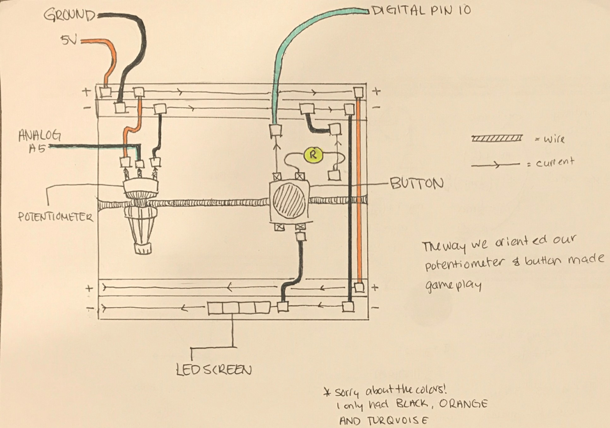

# Arduino Micro Arcade Project
Team Name: Chicken Nuggets

Team Member Names: Maggie (Yi) Xia, Jasmine Wang, Britney Cheng, Cindy Gu

Team Member UniqNames: yixia, jazzyw, britc, cindygu

NOVEMBER 20
- Finished setting up Arduino and LED screen
- Implemented constructors and some functions in distribution_code.ino
- Print functions implemented in distribution_code.ino
- Created new folder in repository called reach

NOVEMBER 27
- Updated game class level_cleared() and update() functions
- Fixed draw_with_rbg() function in both invader and player classes
- Created game class spawn() function for invaders
- Added cannonball move functiion

NOVEMBER 28
- Fixed sinking player bug
- Wrote reset(), fire(), move(), draw(), erase() functions for the Cannonball class
- Fixed update() function in the game class

NOVEMBER 29
- Modified invader and game functions to ignore invaders of strength zero
- Edited game_over() function to account for when invader lives = 0 
- Edited so that only one cannonball can be fired at a time and moves uniformly
- Erase invaders and cannonball when hit
- Fixed any class residue

NOVEMBER 30
- Player dies when in contact with invader
- Button smoothing
- Fixed player not dying bug
- Edited for readability
- Last changes to core implementation

PLEASE SEE README FILE IN REACH FOLDER FOR CHANGES TO REACH IMPLEMENTATION

Final Project: Core Implementation is located in the distribution_code folder

Final Project: Reach Implementation is located in the reach folder

Breadboard Setup:

